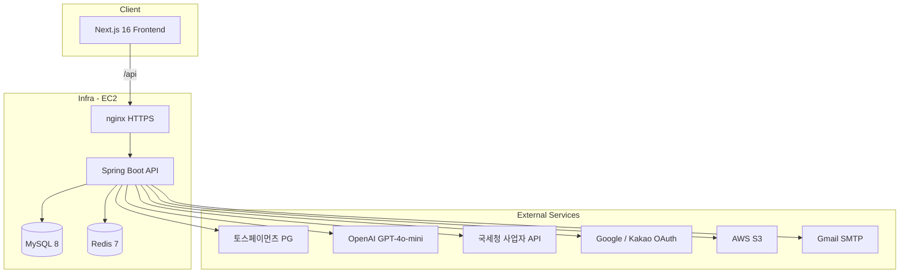
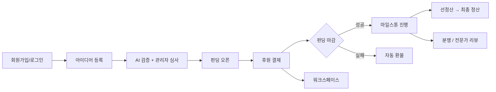

# SeedLink

> 신뢰 기반 크라우드펀딩 후원 플랫폼 — 아이디어 검증부터 펀딩·결제·마일스톤 정산까지 전 주기를 관리합니다.

[](#테스트)
[](#테스트)
[](https://seedlink.site)

**NBE 9기 11팀 04조** | 백엔드 5인 | 2026

---

## 목차

- [프로젝트 소개](#프로젝트-소개)
- [팀 구성 & 역할 분담](#팀-구성--역할-분담)
- [시스템 아키텍처](#시스템-아키텍처)
- [핵심 기능](#핵심-기능)
- [기술 스택](#기술-스택)
- [프로젝트 구조](#프로젝트-구조)
- [시작하기](#시작하기)
- [테스트](#테스트)
- [배포 & CI/CD](#배포--cicd)
- [담당자별 상세 문서](#담당자별-상세-문서)

---

## 프로젝트 소개

### 배경

일반 크라우드펀딩 플랫폼은 **아이디어의 신뢰성**과 **자금 사용 투명성**을 충분히 검증하기 어렵습니다.  
후원자는 제안자를 믿고 결제하지만, 프로젝트 실패·분쟁·환불 지연 등의 리스크가 존재합니다.

### 해결 방향

**SeedLink**는 다음 세 가지 축으로 신뢰를 구축합니다.

| 축 | 설명 |
|----|------|
| **AI + 관리자 검증** | OpenAI 기반 아이디어 사전 검증 + 관리자 심사로 허위·부적절 프로젝트 차단 |
| **마일스톤 기반 자금 집행** | 펀딩 성공 후 단계별 완료 보고·선정산·최종 정산으로 자금을 분할 지급 |
| **결제 정합성** | 토스페이먼츠 PG 연동 + 가상계좌 내부 장부(`vbank_ledgers`)로 입출금 추적 |

### 서비스 URL

| 환경 | URL |
|------|-----|
| **운영 (프론트)** | https://seedlink.site |
| **운영 (API)** | https://seedlink.site/api |
| **로컬 API** | http://localhost:8080 |
| **로컬 프론트** | http://localhost:3000 |
| **Swagger (로컬)** | http://localhost:8080/swagger-ui.html |

---

## 팀 구성 & 역할 분담

| 담당 | 이름 | 메인 도메인 | 서브 도메인 |
|:----:|------|------------|------------|
| A | 김정욱 | `funding`, `payment` | `workspace` |
| B | 배재현 | `settlement` | `milestone` |
| C | 김하늘 | `verification` | `idea` |
| D | 김민혁 | `expert` | `admin`, `match` |
| E | 김경탁 | `notification` | `auth`, `user`, `dispute` |

각 담당자의 설계 결정·API 상세·테스트 결과는 [담당자별 상세 문서](#담당자별-상세-문서)를 참고하세요.

---

## 시스템 아키텍처



### 비즈니스 플로우



### 백엔드 도메인 구조

15개 도메인 패키지로 관심사를 분리했습니다.

```
com.team04
├── domain/
│   ├── auth, user, businessregistration   ← 인증·회원
│   ├── idea, verification                 ← 아이디어·AI 검증
│   ├── funding, payment, settlement       ← 펀딩·결제·정산
│   ├── milestone, workspace               ← 마일스톤·워크스페이스
│   ├── expert, match, dispute             ← 전문가·매칭·분쟁
│   ├── notification, admin                ← 알림·관리자
├── global/    ← Security, Config, Storage, Exception
└── infra/     ← Batch Scheduler, Redis, Email, OpenAI Client
```

---

## 핵심 기능

### 사용자 (USER / EXPERT)

- 이메일·Google·Kakao OAuth 회원가입 / JWT 인증
- 아이디어 초안 작성 → AI 검증 → 관리자 승인 → 펀딩 오픈
- 토스페이먼츠 결제 (카드·가상계좌), 후원 취소·환불
- 펀딩 달성률 **SSE** 실시간 조회
- 마일스톤 완료 보고, 자금 사용 내역 등록
- 후원자↔제안자 **워크스페이스** 메시지
- 전문가 인증 (사업자·국가자격), 프로젝트 매칭·리뷰
- 분쟁 접수·이의신청, **SSE** 실시간 알림

### 관리자 (ADMIN)

- 아이디어·전문가 심사, 마일스톤 보고서 승인/반려
- 보증금 판정, 선정산·최종 정산 관리
- 분쟁 처리, 사용자·대시보드 운영

### 배치 스케줄러 (8종)

| 스케줄러 | 주기 | 역할 |
|----------|------|------|
| `SettlementScheduler` | 매일 00:00 | 펀딩 마감 확정, 환불 생성 |
| `MilestoneScheduler` | 매일 00:00 | 기한 초과 → 보증금 몰수 |
| `RefundPendingScheduler` | 60초 | PENDING 환불 PG 처리 |
| `PayoutRetryScheduler` | 60초 | 지급대행 재시도 |
| `NotificationOutboxScheduler` | 10초 | 알림 Outbox 발송 |
| `VbankExpireScheduler` | 매일 01:00 | 가상계좌 입금 기한 만료 |
| `NotificationScheduler` | 매일 00:00 | 마감 7일 전 알림 |
| `ExpertVerificationScheduler` | cron | 전문가 재검증·격리 해제 |

---

## 기술 스택

### Backend

| 분류 | 기술 |
|------|------|
| Language / Framework | Java 25, Spring Boot 4.0.6 |
| Build | Gradle 9.5 (Kotlin DSL) |
| Database | MySQL 8, JPA + QueryDSL 5.6 |
| Cache | Redis (OTP, Refresh Token, OAuth State) |
| Security | Spring Security, JWT (jjwt), BCrypt |
| API Docs | SpringDoc OpenAPI 3 |
| Resilience | Resilience4j, Spring Retry |
| Storage | AWS S3 (이미지·보고서) |

### Frontend

| 분류 | 기술 |
|------|------|
| Framework | Next.js 16 (App Router, standalone) |
| UI | React 19, TypeScript, Tailwind CSS v4 |
| State | React Query, Zustand, Axios |
| Payment | @tosspayments/payment-sdk |
| Realtime | SSE (펀딩 달성률, 알림) |

### Infra / DevOps

| 분류 | 기술 |
|------|------|
| Container | Docker Compose (app + mysql + redis + frontend) |
| Web Server | nginx (HTTPS, API 프록시) |
| CI | GitHub Actions — PR 시 backend/frontend 분리 빌드·테스트 |
| CD | `main` push → EC2 SSH 배포 |

### External APIs

| 서비스 | 용도 |
|--------|------|
| 토스페이먼츠 | 결제·환불·지급대행·웹훅 |
| OpenAI GPT-4o-mini | 아이디어 AI 검증 |
| 국세청 (odcloud) | 사업자등록번호 검증 |
| Google / Kakao | OAuth 소셜 로그인 |
| AWS S3 | 파일 스토리지 |
| Gmail SMTP | 이메일 OTP |

---

## 프로젝트 구조

```
NBE9-11-final-Team04/
├── backend/                    # Spring Boot API 서버
│   ├── src/main/java/com/team04/
│   │   ├── domain/             # 15개 비즈니스 도메인
│   │   ├── global/             # Security, Config, Storage
│   │   └── infra/              # Batch, Redis, Email, OpenAI
│   ├── src/test/java/          # 단위·E2E 테스트 (46개)
│   ├── postman/                # Newman API 시나리오 (120+ API)
│   ├── performance/k6/         # 부하·동시성·정합성 테스트
│   └── docs/                   # 기술 문서
├── frontend/                   # Next.js 프론트엔드
│   └── src/app/                # App Router 페이지
├── infra/                      # Docker, nginx, docker-compose
├── .github/workflows/          # CI/CD 파이프라인
└── docs/                       # 담당자별 도메인 포트폴리오 문서
```

---

## 시작하기

### 사전 요구사항

- JDK 25, Node.js 20+
- MySQL 8, Redis 7
- (선택) k6, Newman — 성능/API 테스트용

### Backend

```powershell
cd backend

# application-local.yml 설정 (DB 3307 등)
# application-local.yml.default 참고

$env:SPRING_PROFILES_ACTIVE='local'
.\gradlew.bat bootRun
```

API: http://localhost:8080  
Swagger: http://localhost:8080/swagger-ui.html

MySQL 시드 초기화:

```powershell
.\performance\scripts\reset-seed.ps1
```

### Frontend

```bash
cd frontend
npm install
npm run dev
```

http://localhost:3000 (API는 `/api` → `localhost:8080` 프록시)

### Docker (전체 스택)

```bash
cd infra
docker compose up -d
```

---

## 테스트

### 단위 / 통합 테스트

```powershell
cd backend
.\gradlew.bat test
```

CI에서 MySQL 8 + Redis 7 서비스 컨테이너와 함께 자동 실행됩니다.

| 영역 | 대표 테스트 |
|------|------------|
| 결제 동시성 | `PaymentFundingCancelRaceTest`, `PaymentWebhookIdempotencyTest` |
| 펀딩 E2E | `FundingPaymentE2ETest` |
| 정산 배치 | `SettlementSchedulerTest`, `PayoutRetrySchedulerTest` |
| AI 검증 | `VerificationAsyncProcessorTest` |
| 알림 Outbox | `NotificationOutboxProcessorTest` |

### API Smoke (Newman)

```powershell
cd backend/postman
.\run-postman-smoke.ps1
```

17개 사용자 시나리오 폴더, 120+ API 엔드포인트 검증.  
HTML 리포트: `backend/postman/reports/`

### 부하 / 정합성 (k6)

```powershell
cd backend
.\performance\scripts\run-k6-concurrency.ps1      # 조회 부하 (100~1000 VU)
.\performance\scripts\run-k6-payment-realistic.ps1  # 결제 동시성
.\performance\scripts\validate-payment-ledger.ps1   # DB 장부 정합성
```

상세 가이드: [backend/README.md](backend/README.md)

---

## 배포 & CI/CD

### CI (Pull Request)

| Workflow | 트리거 | 내용 |
|----------|--------|------|
| `ci-backend.yml` | PR → `main`/`dev`, `backend/**` | JDK 25, MySQL + Redis, `./gradlew build` |
| `ci-frontend.yml` | PR → `main`/`dev`, `frontend/**` | Node 20, `npm ci && npm run build` |

### CD (Production)

`main` 브랜치 push 시 GitHub Actions가 EC2에 자동 배포합니다.

1. Backend JAR → Docker 이미지 (`seedlink-app`)
2. Frontend → Docker 이미지 (`seedlink-frontend`)
3. EC2에 `docker compose up -d` (app + mysql + redis + frontend)
4. nginx HTTPS 설정 (`seedlink.site`)

---

## 담당자별 상세 문서

각 문서에 API 목록, 설계 결정, 트러블슈팅, 테스트 결과가 포함됩니다.

| 담당 | 문서 | 주요 내용 |
|:----:|------|----------|
| 김정욱 | [docs/domain-funding-payment.md](docs/domain-funding-payment.md) | 토스 PG 연동, VbankLedger 정합성, 결제 동시성 테스트 |
| 배재현 | [docs/domain-settlement-milestone.md](docs/domain-settlement-milestone.md) | 선정산·환불 배치, 마일스톤 상태머신 |
| 김하늘 | [docs/domain-verification-idea.md](docs/domain-verification-idea.md) | OpenAI 비동기 검증, 신뢰점수, 아이디어 라이프사이클 |
| 김민혁 | [docs/domain-expert-admin-match.md](docs/domain-expert-admin-match.md) | 전문가 인증, 관리자 운영, 매칭·리뷰 |
| 김경탁 | [docs/domain-notification-auth.md](docs/domain-notification-auth.md) | Outbox 패턴, JWT/OAuth, 분쟁 처리 |

### 추가 기술 문서

| 문서 | 설명 |
|------|------|
| [backend/README.md](backend/README.md) | k6/Newman 성능 테스트 가이드 & 결과 |
| [backend/docs/portfolio-payment-concurrency-testing.md](backend/docs/portfolio-payment-concurrency-testing.md) | 결제 동시성 레이스 버그 발견·해결 과정 |
| [backend/docs/demo-user-scenario-test-report.md](backend/docs/demo-user-scenario-test-report.md) | 사용자 시나리오 시연 테스트 리포트 |
| [frontend/README.md](frontend/README.md) | 프론트엔드 시작 가이드 |

---

## 라이선스

이 프로젝트는 NBE 9기 11팀 04조 교육 과정의 최종 팀 프로젝트입니다.
