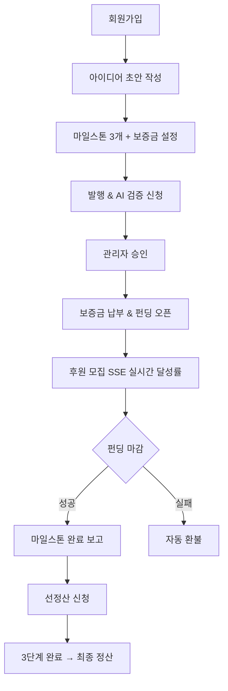
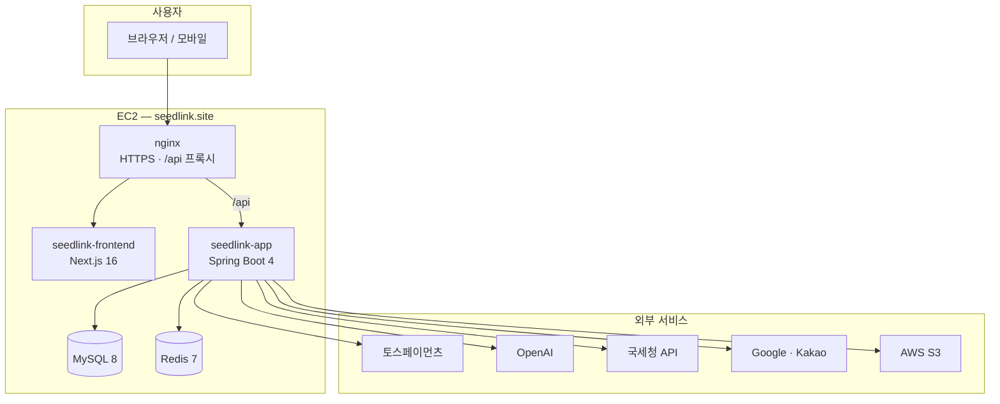
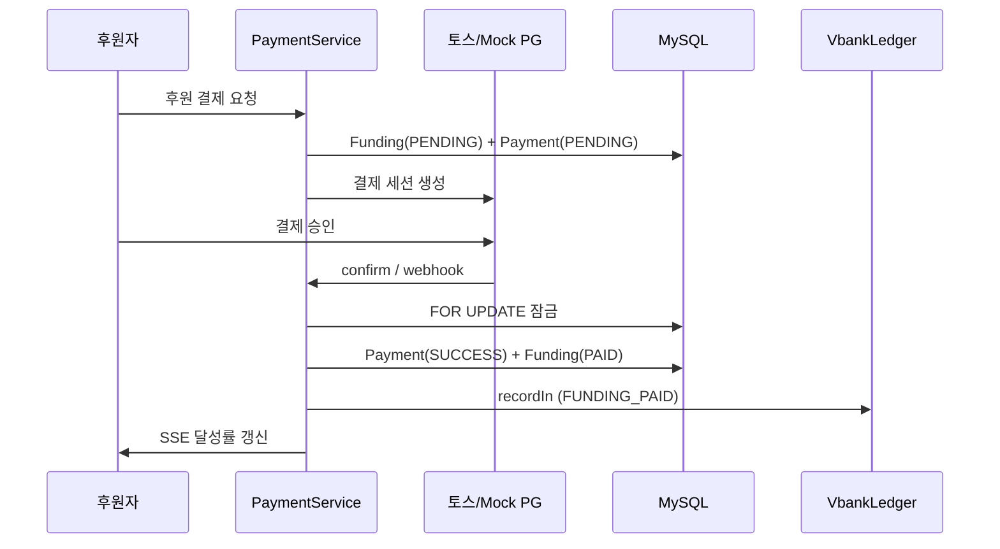
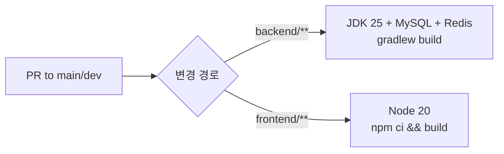
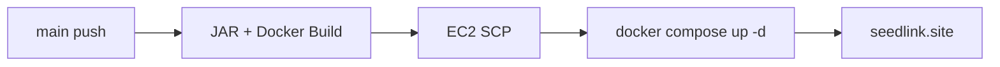

<div align="center">

# 🌱 SeedLink

### 신뢰 기반 크라우드펀딩 후원 플랫폼

아이디어 검증부터 펀딩·결제·마일스톤 정산까지 **프로젝트 전 주기**를 관리합니다.

<br>

[](https://seedlink.site)
[](https://spring.io/projects/spring-boot)
[](https://nextjs.org/)
[](https://openjdk.org/)
[](https://www.mysql.com/)

<br>

**[🚀 서비스 바로가기](https://seedlink.site)** &nbsp;·&nbsp; **[📖 API 문서 (로컬)](http://localhost:8080/swagger-ui.html)** &nbsp;·&nbsp; **[📋 담당자 문서](#-담당자별-상세-문서)**

<br>

`NBE 9기` &nbsp;|&nbsp; `11팀 04조` &nbsp;|&nbsp; `백엔드 5인` &nbsp;|&nbsp; `2026`

</div>

---

## 📌 목차

<details open>
<summary><b>펼치기 / 접기</b></summary>

- [프로젝트 한눈에 보기](#-프로젝트-한눈에-보기)
- [왜 SeedLink인가](#-왜-seedlink인가)
- [주요 성과 & 기술 하이라이트](#-주요-성과--기술-하이라이트)
- [팀 구성 & 역할 분담](#-팀-구성--역할-분담)
- [사용자 시나리오](#-사용자-시나리오)
- [시스템 아키텍처](#-시스템-아키텍처)
- [핵심 기능](#-핵심-기능)
- [기술 스택](#-기술-스택)
- [프로젝트 구조](#-프로젝트-구조)
- [시작하기](#-시작하기)
- [테스트](#-테스트)
- [배포 & CI/CD](#-배포--cicd)
- [담당자별 상세 문서](#-담당자별-상세-문서)

</details>

---

## 👀 프로젝트 한눈에 보기

| 항목 | 내용 |
|------|------|
| **서비스명** | SeedLink — 신뢰 기반 크라우드펀딩 후원 플랫폼 |
| **운영 URL** | https://seedlink.site |
| **API** | https://seedlink.site/api |
| **개발 기간** | 2026 (NBE 9기 최종 팀 프로젝트) |
| **팀 구성** | 백엔드 5인 + 프론트엔드 |
| **저장소 구조** | Monorepo (`backend` + `frontend` + `infra`) |

### 서비스 접속 정보

| 환경 | URL | 비고 |
|------|-----|------|
| 운영 (프론트) | https://seedlink.site | HTTPS, EC2 배포 |
| 운영 (API) | https://seedlink.site/api | nginx 프록시 |
| 로컬 API | http://localhost:8080 | `SPRING_PROFILES_ACTIVE=local` |
| 로컬 프론트 | http://localhost:3000 | `/api` → 8080 프록시 |
| Swagger | http://localhost:8080/swagger-ui.html | 로컬 전용 |

### 코드 규모 (백엔드 기준)

| 항목 | 수량 |
|------|------|
| 도메인 패키지 | 15개 |
| REST 컨트롤러 | 28개 |
| API 엔드포인트 | 150+ |
| JPA 엔티티 | 35+ |
| 배치 스케줄러 | 8종 |
| 단위·통합 테스트 | 46개 |
| Postman 시나리오 | 17개 폴더 / 120+ API |
| k6 부하 시나리오 | 10+ |

---

## 💡 왜 SeedLink인가

### 문제 인식

일반 크라우드펀딩에서는 다음 리스크가 반복됩니다.

| 문제 | 현실 |
|------|------|
| 아이디어 신뢰성 | 허위·과장 프로젝트 심사 부담 |
| 자금 집행 | 펀딩 성공 후 일괄 송금 → 이행 실패 시 후원자 피해 |
| 결제·환불 | 동시 요청 시 상태 불일치, 환불 지연 |
| 분쟁 처리 | 신고·이의·환불이 시스템적으로 연결되지 않음 |

### SeedLink의 해결책

```
┌─────────────────────────────────────────────────────────────────┐
│  ① 검증          OpenAI AI 검증 + 관리자 심사 + 전문가 리뷰       │
│  ② 분할 집행      마일스톤 3단계 → 선정산 → 최종 정산              │
│  ③ 결제 정합성    토스 PG + VbankLedger 내부 장부 + 동시성 제어   │
│  ④ 운영 자동화    8종 배치 스케줄러 (환불·지급·알림·만료)         │
└─────────────────────────────────────────────────────────────────┘
```

| 신뢰 축 | 구현 |
|---------|------|
| **사전 검증** | 금칙어 필터 → OpenAI 비동기 검증 → 관리자 최종 심사 → 신뢰점수(0~20) |
| **단계별 집행** | 펀딩 성공 → 마일스톤 완료 보고 → 선정산(지급대행) → 최종 정산(수수료 1%) |
| **결제 추적** | `payments` + `fundings` + `vbank_ledgers` 삼각 구조, `idempotency_key` 멱등성 |
| **실패 보호** | 목표 미달 시 자동 환불, 기한 초과 시 보증금 몰수, 분쟁 시 정산 연동 |

---

## 🏆 주요 성과 & 기술 하이라이트

> 포트폴리오·면접에서 강조할 수 있는 구현 포인트입니다.

| # | 하이라이트 | 상세 |
|:-:|-----------|------|
| 1 | **실서비스 배포** | EC2 + Docker Compose + nginx HTTPS → [seedlink.site](https://seedlink.site) |
| 2 | **토스페이먼츠 PG** | 결제·환불·가상계좌·지급대행·웹훅 멱등성 처리 |
| 3 | **결제 동시성 버그 해결** | k6 부하 테스트로 입금 vs 취소 레이스 발견 → `FOR UPDATE` 잠금 수정 → [상세 문서](backend/docs/portfolio-payment-concurrency-testing.md) |
| 4 | **Transactional Outbox** | 알림 유실 방지 — 비즈니스 TX와 Outbox 원자적 커밋 |
| 5 | **OpenAI 비동기 검증** | `@Async` + `AFTER_COMMIT` 이벤트, 장애 시 관리자 폴백 |
| 6 | **CI/CD** | PR별 backend/frontend 분리 빌드, `main` push 시 자동 배포 |
| 7 | **테스트 체계** | JUnit 46개 + Newman 120+ API + k6 1000 VU 부하·정합성 |

---

## 👥 팀 구성 & 역할 분담

<table>
  <thead>
    <tr>
      <th align="center">담당</th>
      <th align="center">이름</th>
      <th align="left">메인 도메인</th>
      <th align="left">서브 도메인</th>
      <th align="left">포트폴리오 문서</th>
    </tr>
  </thead>
  <tbody>
    <tr>
      <td align="center"><b>A</b></td>
      <td align="center">김정욱</td>
      <td><code>funding</code> <code>payment</code></td>
      <td><code>workspace</code></td>
      <td><a href="docs/domain-funding-payment.md">펀딩·결제</a></td>
    </tr>
    <tr>
      <td align="center"><b>B</b></td>
      <td align="center">배재현</td>
      <td><code>settlement</code></td>
      <td><code>milestone</code></td>
      <td><a href="docs/domain-settlement-milestone.md">정산·마일스톤</a></td>
    </tr>
    <tr>
      <td align="center"><b>C</b></td>
      <td align="center">김하늘</td>
      <td><code>verification</code></td>
      <td><code>idea</code></td>
      <td><a href="docs/domain-verification-idea.md">검증·아이디어</a></td>
    </tr>
    <tr>
      <td align="center"><b>D</b></td>
      <td align="center">김민혁</td>
      <td><code>expert</code></td>
      <td><code>admin</code> <code>match</code></td>
      <td><a href="docs/domain-expert-admin-match.md">전문가·관리자</a></td>
    </tr>
    <tr>
      <td align="center"><b>E</b></td>
      <td align="center">김경탁</td>
      <td><code>notification</code></td>
      <td><code>auth</code> <code>user</code> <code>dispute</code></td>
      <td><a href="docs/domain-notification-auth.md">알림·인증</a></td>
    </tr>
  </tbody>
</table>

각 담당자 문서에는 **설계 결정 · 예상/실제 문제 · 해결 사례 · 테스트 결과**가 포함되어 있습니다.

---

## 🎭 사용자 시나리오

### 제안자 (Proposer) 여정



### 후원자 (Sponsor) 여정

```
아이디어 탐색 → 신뢰점수 확인 → 후원 결제(토스) → 워크스페이스 입장
→ 제안자와 메시지 교환 → 자금 사용 내역 조회 → (필요 시) 분쟁 신고
```

### 전문가 (Expert) 여정

```
전문가 인증(사업자/국가자격) → 매칭 요청 수락/거절 → 프로젝트 리뷰 작성
```

### 관리자 (Admin) 여정

```
대시보드 → 아이디어·전문가 심사 → 마일스톤 보고서 승인/반려
→ 보증금 판정 → 선정산·정산 관리 → 분쟁 처리
```

---

## 🏗 시스템 아키텍처

### 인프라 구성도



### 백엔드 레이어 구조

```
┌──────────────────────────────────────────────────────────┐
│  Presentation   Controller (28개) · SSE · Swagger        │
├──────────────────────────────────────────────────────────┤
│  Application    Service (40+) · Event · Scheduler (8)    │
├──────────────────────────────────────────────────────────┤
│  Domain         Entity (35+) · Enum · Domain Event       │
├──────────────────────────────────────────────────────────┤
│  Infrastructure JPA · Redis · S3 · OpenAI · Email · PG   │
└──────────────────────────────────────────────────────────┘
```

### 도메인 패키지 (15개)

```
com.team04
├── domain/
│   ├── auth · user · businessregistration     인증 · 회원 · 사업자
│   ├── idea · verification                      아이디어 · AI 검증
│   ├── funding · payment · settlement         펀딩 · 결제 · 정산
│   ├── milestone · workspace                    마일스톤 · 워크스페이스
│   ├── expert · match · dispute               전문가 · 매칭 · 분쟁
│   └── notification · admin                   알림 · 관리자
├── global/          Security · Config · Storage · Exception
└── infra/           Batch · Redis · Email · OpenAI Client
```

### 결제·정산 데이터 흐름



---

## ⚡ 핵심 기능

### 역할별 기능 매트릭스

| 기능 | USER | EXPERT | ADMIN |
|------|:----:|:------:|:-----:|
| 이메일 · OAuth 로그인 | ✅ | ✅ | ✅ |
| 아이디어 등록 · AI 검증 | ✅ | — | — |
| 후원 결제 · 취소 · 환불 | ✅ | ✅ | — |
| 펀딩 달성률 SSE | ✅ | ✅ | — |
| 워크스페이스 메시지 | ✅ | — | — |
| 전문가 인증 · 매칭 · 리뷰 | — | ✅ | — |
| 분쟁 신고 · 이의신청 | ✅ | ✅ | — |
| 실시간 알림 SSE | ✅ | ✅ | ✅ |
| 아이디어 · 전문가 심사 | — | — | ✅ |
| 마일스톤 · 정산 · 분쟁 처리 | — | — | ✅ |

### 주요 API 영역

| 도메인 | 대표 API | 설명 |
|--------|----------|------|
| Auth | `POST /auth/signup`, `/auth/login`, `/auth/oauth/{provider}` | JWT + Redis Refresh |
| Idea | `POST /ideas/drafts`, `/ideas/drafts/{id}/publish` | 초안 → 발행, 22개 API |
| Verification | `POST /verifications` | OpenAI 비동기 검증 |
| Funding | `POST /fundings/{ideaId}/sponsors`, `GET .../sse` | 후원 + 실시간 달성률 |
| Payment | `POST /payments`, `/payments/{id}/confirm`, `/webhooks/**` | 토스 PG + 장부 |
| Settlement | `POST /pre-settlements`, `GET /settlements` | 선정산 · 최종 정산 |
| Milestone | `POST /milestones/{id}/reports` | 완료 보고 · 자금 사용 |
| Notification | `GET /notifications/stream` | SSE 실시간 알림 |

### 배치 스케줄러 (8종)

| 스케줄러 | 주기 | 역할 |
|----------|------|------|
| `SettlementScheduler` | 매일 00:00 | 펀딩 마감 확정 · 환불 생성 |
| `MilestoneScheduler` | 매일 00:00 KST | 기한 초과 감지 → 7일 유예 → 보증금 몰수 |
| `RefundPendingScheduler` | 60초 | PENDING 환불 PG 처리 |
| `PayoutRetryScheduler` | 60초 | 선정산·정산 지급대행 재시도 |
| `NotificationOutboxScheduler` | 10초 | 알림 Outbox 비동기 발송 |
| `VbankExpireScheduler` | 매일 01:00 | 가상계좌 입금 기한 만료 |
| `NotificationScheduler` | 매일 00:00 | 펀딩 마감 7일 전 알림 |
| `ExpertVerificationScheduler` | cron | 전문가 재검증 · 격리 해제 |

---

## 🛠 기술 스택

<table>
  <tr>
    <th colspan="2" align="center">Backend</th>
    <th colspan="2" align="center">Frontend</th>
    <th colspan="2" align="center">Infra / DevOps</th>
  </tr>
  <tr>
    <td>Java 25</td>
    <td>Spring Boot 4.0.6</td>
    <td>Next.js 16</td>
    <td>React 19</td>
    <td>Docker Compose</td>
    <td>EC2</td>
  </tr>
  <tr>
    <td>Gradle 9.5</td>
    <td>JPA + QueryDSL</td>
    <td>TypeScript</td>
    <td>Tailwind v4</td>
    <td>nginx HTTPS</td>
    <td>GitHub Actions</td>
  </tr>
  <tr>
    <td>MySQL 8</td>
    <td>Redis 7</td>
    <td>React Query</td>
    <td>Zustand</td>
    <td>CI (PR 빌드)</td>
    <td>CD (main 배포)</td>
  </tr>
  <tr>
    <td>Spring Security</td>
    <td>JWT (jjwt)</td>
    <td>Axios</td>
    <td>Toss Payment SDK</td>
    <td>Let's Encrypt</td>
    <td>SpringDoc OpenAPI</td>
  </tr>
  <tr>
    <td>Resilience4j</td>
    <td>AWS S3</td>
    <td>SSE</td>
    <td>App Router</td>
    <td>k6 · Newman</td>
    <td>JUnit 5</td>
  </tr>
</table>

### 외부 연동

| 서비스 | 용도 | 담당 도메인 |
|--------|------|------------|
| 토스페이먼츠 | 결제 · 환불 · 가상계좌 · 지급대행 · 웹훅 | `payment` |
| OpenAI GPT-4o-mini | 아이디어 AI 검증 (구조화 JSON) | `verification` |
| 국세청 odcloud | 사업자등록번호 · 전문가 인증 | `expert`, `businessregistration` |
| Google / Kakao OAuth | 소셜 로그인 | `auth` |
| AWS S3 | 이미지 · 보고서 · 분쟁 증거 파일 | `global/storage` |
| Gmail SMTP | 이메일 OTP 인증 | `auth` |

---

## 📁 프로젝트 구조

```
NBE9-11-final-Team04/
│
├── 📂 backend/                         Spring Boot API
│   ├── src/main/java/com/team04/
│   │   ├── domain/                     15개 비즈니스 도메인
│   │   ├── global/                     Security · Config · Storage
│   │   └── infra/                      Batch · Redis · Email · OpenAI
│   ├── src/test/java/                  46개 테스트
│   ├── postman/                        Newman 120+ API 시나리오
│   ├── performance/k6/                 부하 · 동시성 · 정합성
│   └── docs/                           결제 동시성 등 기술 문서
│
├── 📂 frontend/                        Next.js 16 App Router
│   └── src/
│       ├── app/                        페이지 (30+ 라우트)
│       ├── api/                        Axios API 모듈
│       ├── components/                 UI 컴포넌트
│       └── hooks/                      SSE · 알림 훅
│
├── 📂 infra/                           Docker · nginx · docker-compose
├── 📂 .github/workflows/               CI/CD 파이프라인
└── 📂 docs/                            담당자별 포트폴리오 문서 (5개)
```

### 프론트엔드 주요 라우트

| 경로 | 설명 |
|------|------|
| `/` | 홈 · 인기 아이디어 |
| `/ideas`, `/ideas/new` | 아이디어 목록 · 등록 |
| `/fundings/idea/[id]` | 펀딩 상세 + SSE 달성률 |
| `/payments/success`, `/fail` | 토스 결제 콜백 |
| `/workspaces/[id]` | 후원자↔제안자 워크스페이스 |
| `/mypage/*` | 결제·환불·알림·분쟁 마이페이지 |
| `/expert/*` | 전문가 인증 · 매칭 · 리뷰 |
| `/admin/*` | 관리자 대시보드 · 심사 · 정산 |

---

## 🚀 시작하기

### 사전 요구사항

| 도구 | 버전 | 용도 |
|------|------|------|
| JDK | 25 | 백엔드 |
| Node.js | 20+ | 프론트엔드 |
| MySQL | 8 | DB (로컬 3307 권장) |
| Redis | 7 | OTP · Refresh Token |
| Docker | (선택) | 전체 스택 실행 |
| k6 · Newman | (선택) | 성능 · API 테스트 |

### 1️⃣ Backend

```powershell
cd backend

# application-local.yml 설정
# → application-local.yml.default 참고 (DB port 3307 등)

$env:SPRING_PROFILES_ACTIVE='local'
.\gradlew.bat bootRun
```

| 항목 | URL |
|------|-----|
| API | http://localhost:8080 |
| Swagger | http://localhost:8080/swagger-ui.html |
| Health | http://localhost:8080/actuator/health |

시드 데이터 초기화:

```powershell
.\performance\scripts\reset-seed.ps1
```

### 2️⃣ Frontend

```bash
cd frontend
npm install
npm run dev
```

→ http://localhost:3000 (API `/api` → `localhost:8080` 프록시)

### 3️⃣ Docker (전체 스택)

```bash
cd infra
cp payment.env.example payment.env   # 환경변수 설정
docker compose up -d
```

### 로컬 환경 요약

| 서비스 | 주소 | 비고 |
|--------|------|------|
| Spring Boot | `localhost:8080` | API |
| MySQL 8 | `localhost:3307/seedlink` | 로컬 권장 포트 |
| Redis | `localhost:6379` | 캐시 |
| Next.js | `localhost:3000` | 프론트 |

---

## 🧪 테스트

### 테스트 피라미드

```
                    ┌─────────────┐
                    │  k6 부하    │  100~1000 VU · 결제 동시성
                    ├─────────────┤
                    │ Newman E2E  │  120+ API · 17 시나리오
                    ├─────────────┤
                    │ JUnit 46개  │  단위 · 통합 · 레이스 테스트
                    └─────────────┘
```

### 단위 / 통합 테스트

```powershell
cd backend
.\gradlew.bat test
```

| 영역 | 대표 테스트 | 검증 내용 |
|------|------------|----------|
| 결제 동시성 | `PaymentFundingCancelRaceTest` | 입금 vs 취소 2스레드 레이스 |
| 웹훅 멱등성 | `PaymentWebhookIdempotencyTest` | 중복 웹훅 방지 |
| 펀딩 E2E | `FundingPaymentE2ETest` | 후원→결제 전체 흐름 |
| 정산 배치 | `SettlementSchedulerTest` | 펀딩 마감 환불 |
| 지급 재시도 | `PayoutRetrySchedulerTest` | 지급대행 실패 복구 |
| AI 검증 | `VerificationAsyncProcessorTest` | 비동기 검증 파이프라인 |
| 알림 Outbox | `NotificationOutboxProcessorTest` | Outbox 처리 · 재시도 |

### API Smoke (Newman)

```powershell
cd backend/postman
.\run-postman-smoke.ps1
```

- 17개 사용자 흐름 폴더 (제안자 → 후원자 → 관리자 → 전문가)
- HTML 리포트: `backend/postman/reports/`

### 부하 / 정합성 (k6)

```powershell
cd backend
.\performance\scripts\run-k6-concurrency.ps1         # 조회 100~1000 VU
.\performance\scripts\run-k6-payment-realistic.ps1   # 결제 동시성
.\performance\scripts\validate-payment-ledger.ps1    # DB 장부 SQL 검증
```

상세 가이드 및 결과표: [backend/README.md](backend/README.md)

---

## 🚢 배포 & CI/CD

### CI — Pull Request



| Workflow | 트리거 | 내용 |
|----------|--------|------|
| `ci-backend.yml` | PR → `main`/`dev`, `backend/**` | `./gradlew build` (테스트 포함) |
| `ci-frontend.yml` | PR → `main`/`dev`, `frontend/**` | `npm ci && npm run build` |

### CD — Production



1. Backend JAR → `seedlink-app:latest`
2. Frontend → `seedlink-frontend:latest`
3. EC2: `docker compose up -d` (app + mysql + redis + frontend)
4. nginx HTTPS + `/api` 프록시

---

## 📚 담당자별 상세 문서

각 문서 구성: **설계 방식 → 선택 이유 → 기술 고민 → 예상/실제 문제 → 해결 사례 → 결과**

| 담당 | 이름 | 문서 | 핵심 키워드 |
|:----:|------|------|------------|
| A | 김정욱 | [domain-funding-payment.md](docs/domain-funding-payment.md) | 토스 PG · VbankLedger · 결제 레이스 버그 |
| B | 배재현 | [domain-settlement-milestone.md](docs/domain-settlement-milestone.md) | 선정산 · 환불 배치 · 마일스톤 몰수 |
| C | 김하늘 | [domain-verification-idea.md](docs/domain-verification-idea.md) | OpenAI 비동기 · 신뢰점수 · 아이디어 라이프사이클 |
| D | 김민혁 | [domain-expert-admin-match.md](docs/domain-expert-admin-match.md) | 국세청 인증 · 관리자 운영 · 매칭 |
| E | 김경탁 | [domain-notification-auth.md](docs/domain-notification-auth.md) | Outbox 패턴 · JWT/OAuth · 분쟁 |

### 추가 기술 문서

| 문서 | 설명 |
|------|------|
| [backend/README.md](backend/README.md) | k6/Newman 성능 테스트 가이드 & VU별 결과표 |
| [backend/docs/portfolio-payment-concurrency-testing.md](backend/docs/portfolio-payment-concurrency-testing.md) | 결제 동시성 레이스 버그 Before/After 전체 기록 |
| [backend/docs/demo-user-scenario-test-report.md](backend/docs/demo-user-scenario-test-report.md) | 사용자 시나리오 시연 16/16 API PASS |
| [backend/docs/postman-api-filming-checklist.md](backend/docs/postman-api-filming-checklist.md) | API 시연 영상 촬영 체크리스트 |
| [frontend/README.md](frontend/README.md) | 프론트엔드 시작 가이드 |

---

<div align="center">

<br>

### NBE 9기 11팀 04조 — SeedLink

신뢰할 수 있는 크라우드펀딩, 아이디어에 씨앗을 심다.

<br>

**[🌐 seedlink.site](https://seedlink.site)**

<br>

<sub>이 프로젝트는 NBE 9기 교육 과정의 최종 팀 프로젝트입니다.</sub>

</div>
